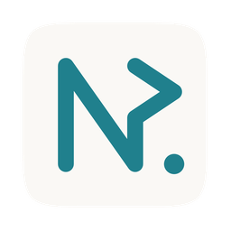

<p align="center">
  
</p>

<h1 align="center">NexQL</h1>

<p align="center">
  A fast, native desktop SQL client for PostgreSQL and SQLite.
</p>

<p align="center">
  <a href="https://github.com/lengzuo/nexql/releases/latest"></a>
  <a href="https://github.com/lengzuo/nexql/releases"></a>
  <a href="LICENSE"></a>
  
</p>

---

## What is NexQL?

NexQL is a native desktop application for connecting to and managing PostgreSQL and SQLite databases. Built with **Rust** and **React/TypeScript**, it delivers a lightweight, secure, and responsive experience without the overhead of Electron-based alternatives.

### Key Features

- **Multi-connection management** — Connect to multiple PostgreSQL and SQLite databases
- **Tabbed query editor** — Write and execute SQL across multiple tabs with syntax highlighting
- **Schema browser** — Browse tables, columns, and database objects at a glance
- **Transaction support** — Full `BEGIN`/`COMMIT`/`ROLLBACK` control per editor session
- **Visual EXPLAIN plans** — Interactive node graphs for PostgreSQL plans and SQLite query plans
- **Virtualized results** — Handle large result sets efficiently with canvas-rendered rows
- **Data export** — Export query results for further analysis
- **Auto-save** — Query buffers are automatically saved and restored across sessions
- **Secure credential storage** — Passwords are stored in the OS Keychain, never in plain text
- **Light native interface** — A focused, high-contrast light theme built for long SQL sessions
- **Internationalization** — Available in English and Simplified Chinese (中文)
- **Auto-updater** — Get notified when a new version is available and update in-app

---

## Screenshots

<!-- 
  TODO: Replace these with actual screenshots.
  Recommended: place images in a docs/screenshots/ folder and reference them here.
  
  Example:
  
  
-->

> Screenshots coming soon. Star the repo to stay updated!

---

## Under the Hood

NexQL is not just another SQL GUI wrapping a web app in a desktop shell. Every layer is engineered for speed and safety.

### Arrow Binary Transfer

Query results are serialized as [Apache Arrow IPC](https://arrow.apache.org/docs/format/Columnar.html) in Rust and decoded zero-copy on the frontend. No JSON marshalling, no string parsing — raw columnar binary straight from the database to your screen.

### Canvas-Rendered Data Grid

Results render on an HTML5 Canvas, not the DOM. Smooth 60fps scrolling through large result sets without layout thrashing or DOM node explosion.

### Async Parallel Execution

Batch queries run as concurrent [Tokio](https://tokio.rs/) tasks in Rust. Table views fetch data and row counts in parallel. The UI never waits for one query to finish before starting the next.

### Auto LIMIT Protection

Unbounded `SELECT` queries automatically receive a configurable LIMIT (default 1000) to prevent accidental full-table scans that could lock up your database or flood your machine with rows. Your existing `LIMIT` clauses are always respected.

### Visual EXPLAIN Plans

View query execution plans as interactive node graphs. PostgreSQL plans include cost, buffer, and timing diagnostics; SQLite query plans surface scan/search steps and index usage.

### Rust Backend

Zero garbage collection. Memory-safe. ~15 MB binary. Connection pooling, transaction session management, and PostgreSQL type mapping all happen in compiled Rust — not a runtime interpreter.

---

## Download

### Latest Release

Download the latest macOS build from [GitHub Releases](https://github.com/lengzuo/nexql/releases/latest).

| Platform | Architecture |
|----------|--------------|
| macOS | Apple Silicon (arm64) |
| macOS | Intel (x64) |

> Windows and Linux builds are not yet available. Star/watch the repo to be notified when they ship.

You can also browse [all releases](https://github.com/lengzuo/nexql/releases) for older versions.

### Installation (macOS)

1. Download the `.dmg` file for your architecture
2. Open the `.dmg` and drag **NexQL** into your Applications folder
3. **Remove the quarantine flag** (code signing is on the way):
   ```bash
   xattr -dr com.apple.quarantine /Applications/NexQL.app
   ```
4. Open NexQL from your Applications folder
5. Connect to your PostgreSQL database and start querying

### Auto-Updates

NexQL checks for updates automatically on launch. When a new version is available, you'll see an in-app notification to download and install it.

---

## Supported Databases

| Database | Status |
|----------|--------|
| PostgreSQL 12+ | Supported |
| SQLite | Supported |
| MySQL | Planned |

---

## System Requirements

- **macOS** 11 (Big Sur) or later
- PostgreSQL 12+ or SQLite as the target database
- ~100 MB disk space

---

## Pricing

NexQL offers a **free tier** for personal use and evaluation. License keys unlock paid/commercial use.

Core SQL client features such as syntax highlighting, schema browsing, transactions, visual plans, auto-save, and export are available in the app.

---

## Security & Privacy

- **Credentials**: Database passwords are stored exclusively in the macOS Keychain — never in config files, SQLite, or plain text
- **Local-first**: All workspace data (saved queries, tab state, connection metadata) is stored locally in a SQLite database. Nothing is sent to external servers
- **No telemetry**: NexQL does not collect analytics, usage data, or crash reports
- **Update check**: The only external network request (besides your database connections) is an update check against GitHub Releases

---

## Reporting Issues

Found a bug or have a feature request? Please [open an issue](https://github.com/lengzuo/nexql/issues/new).

When reporting a bug, include:

- Your macOS version and chip (Apple Silicon / Intel)
- NexQL version (found in **Settings > About**)
- Steps to reproduce the issue
- Any error messages or unexpected behavior

---

## Roadmap

- [ ] Code signing & notarization
- [ ] Windows and Linux support
- [ ] MySQL adapter
- [ ] SSH tunnel connections

---

## License

NexQL is licensed under the [Business Source License 1.1](LICENSE).

| | |
|-|-|
| **Allowed** | Personal use, evaluation, non-commercial use, filing issues and feature requests |
| **Not allowed** | Commercial redistribution, hosting as a service, creating competing products from this source |
| **Change date** | 4 years after each release, the code converts to [Apache License 2.0](https://www.apache.org/licenses/LICENSE-2.0) |

See the [LICENSE](LICENSE) file for the full text.

---

<p align="center">
  Built with <a href="https://v2.tauri.app/">Tauri</a> and <a href="https://www.rust-lang.org/">Rust</a>
</p>
